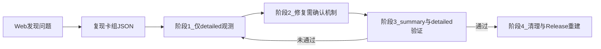

# Web 对战问题闭环调试

## 何时使用

- 用户从 Web 对战模拟中发现异常，并提交**问题描述**与**可用于复现的卡组 / simulate job JSON**。
- 需要按固定阶段执行：根因（仅观测）→ 修复（可改代码）→ 验证（summary + detailed）→ 清理并交付 Release CLI。

**Seed**：若 job 未带 `seed`，先用 `debug.level=detailed` 跑一轮，从结果或日志中取得实际使用的 seed，再固定该 seed 做后续对比（与 `docs/engine_cli.md` 中「先 detailed 再 summary」一致）。

## 与其它规则的关系

- **根因优先**：`AGENTS.md` 重要开发约定 3（root-cause-first）—— 证据驱动，禁止无根据改动。
- **游戏机制变更**：`AGENTS.md` 重要开发约定 2（game-mechanics-confirm）—— 核心帧序、充能/冻结/能力队列等未经用户明确同意不得改；本 skill 的阶段 1/2 是对该约定的**操作化**。

## 阶段 1：定位根因

**允许**

- 阅读与分析 C++（含 `Simulator`、物品/能力实现、`Sink` 等）。
- 仅在 **`debug.level=detailed`** 路径上增加**观测性**输出：扩展 `Sink` 在 `OnFrameEnd`、伤害、施法等 hook 中写入的事件/字段，使 `result.debug.events` 更易定位问题（参见 `engine/include/bazaararena/io/Sink.hpp`）。

**禁止**

- 除上述观测输出外，**不得**做任何会改变战斗语义的行为（包括但不限于：改变主循环顺序、充能/递减顺序、伤害结算、触发条件）。未确认前尤其不要改 `engine/src/bazaararena/core/Simulator.cpp` 中与帧序/队列相关的核心逻辑。
- 禁止用「顺手优化」掩盖问题。

**交付**

- 向用户说明**根因假设**与**证据链**：代码路径、`frame_end` 相关字段（如 `ChargedTime`、`FreezeRemaining`）、事件序列、最小复现说明。
- 若用户否定根因，回到本阶段：增加或调整 detailed 观测，或修正假设后重复。

## 阶段 2：尝试修复

- 在根因已成立的前提下，可修改 C++（及必要的 debug JSON 组装，如 `FillDebugJson`）以修复问题。
- **若修复会改变游戏规则或战斗机制**（与用户设计可能不一致）：必须先列出具体行为变化，**征得用户明确同意**后再改；对 `AbilityQueue` 等与调度语义强绑定的逻辑同样适用。

## 阶段 3：验证

- 使用用户提供的同一复现 JSON，**固定 seed**，调用 `bazaararena_cli` 重跑模拟。
- 分别生成 **summary** 与 **detailed** 两份输出（例如 `verify_summary.json`、`verify_detailed.json`），便于对照可读日志与事件流。
- 对照方式与 job 字段见 `docs/engine_cli.md`；示例输入见 `samples/cli/`。
- 若输出仍不符合预期，**回到阶段 1**。

**CLI 示例**（可执行文件在仓库根 `bin/`，`-B` 可为任意构建目录；详见 `samples/cli/README.md`）

```text
bin/bazaararena_cli --input job.json --output out.json
```

构建与运行说明可参考 `samples/cli/README.md`。

## 阶段 4：清理与交付（含与 Web 对齐）

1. **清理**：删除调试过程中产生的临时文件；**撤销阶段 1 中为观测而增加的 detailed 专用输出**，使默认/既有 debug 契约与修复意图一致（无多余噪声）。
2. **重建 Release**：在仓库根执行 `cmake -S engine -B <build-dir>`（若已配置可跳过）与 `cmake --build <build-dir> --config Release --target bazaararena_cli`。CMake 将 `bazaararena_cli` **固定输出到 `<repo>/bin/`**（Windows：`bin/bazaararena_cli.exe`），见 `engine/CMakeLists.txt`。
3. **物品 / SQLite（条件执行）**：若本次修改涉及 `data/items/*.yaml` 或影响 Web 展示的物品元数据，则运行 `python tools/gen_items_sqlite.py`，更新 `app/backend/data/bazaararena.db`（说明见 `tools/item_codegen/README.md`）。**仅 C++ / 引擎逻辑、未改 YAML 时可跳过**。
4. **CLI 自检**：对 **`<repo>/bin/bazaararena_cli`（或 `.exe`）** 执行 `--version`，确认输出含 `mode=simulate+json` 与 `contract=1`（见 `docs/engine_cli.md`）。
5. **与 Web 进程对齐**：**重启**承载 Flask 的后端进程，使进程加载新的 `bin/` 下可执行文件与（若执行过）新的 `bazaararena.db`。若环境变量 `BAZAARARENA_CLI` 已设置，应指向 `bin/` 下文件或暂时取消设置，以免覆盖默认路径而仍指向陈旧 exe。
6. **Web 侧核对**：调用 `POST /api/simulate`（或等价入口），检查响应中的 **`bazaararenaCliVersion`**（及 `usedSeed` 等与复现一致字段），确认后端实际使用的 CLI 已更新；再由用户在 Web UI 上做最终战斗验证。

## 流程概览


